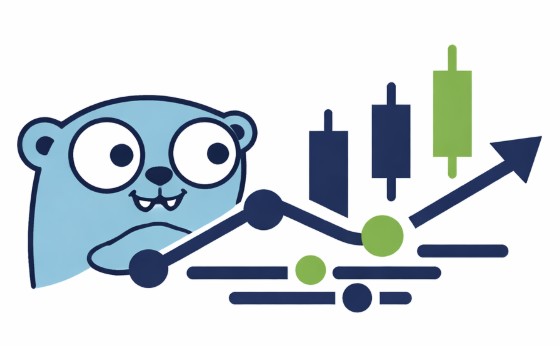
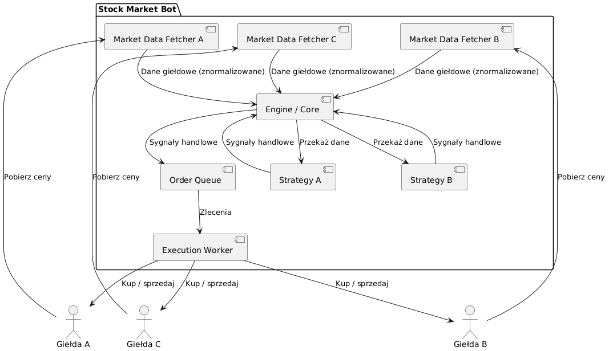
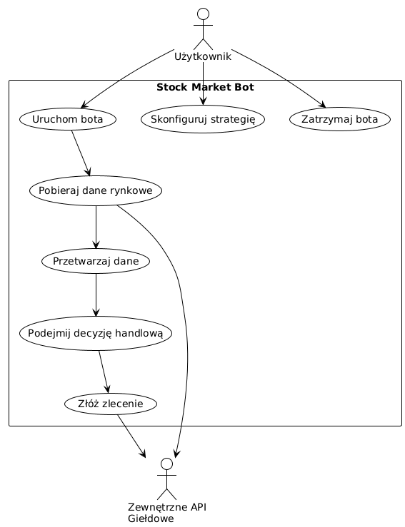

# Stock Market Bot

Celem projektu jest zbudowanie bota śledzącego akcje na giełdzie i odpowiednie reagowanie na nie, wedle założonej strategii inwestycyjnej.

### Wymagania funkcjonalne
System umożliwia pobieranie danych rynkowych z wielu giełd jednocześnie za pośrednictwem ich interfejsów API oraz ich normalizację do wspólnego formatu. Na podstawie otrzymanych danych system analizuje sytuację rynkową przy użyciu predefiniowanych strategii handlowych i podejmuje decyzje inwestycyjne, takie jak kupno, sprzedaż lub brak akcji. Wygenerowane decyzje handlowe są kolejkowane i następnie przekazywane do realizacji poprzez wysyłanie zleceń do odpowiednich giełd.

Dodatkowo w ramach projektu dostępne są testowe interfejsy API giełdowe wraz z testowym portfelem, na których bot jest uruchamiany i weryfikowany bez użycia rzeczywistych środków finansowych.

### Wymagania niefunkcjonalne
Bot wykorzystuje w pełni zasoby dostępne na maszynie, aby zminimalizować opóźnienia w przetwarzaniu danych giełdowych i odpowiednio na nie reagować.
Zastosowany język programowania Golang pozwala na łatwe wykorzystanie równoległości dzięki goroutines, które są lekkimi wątkami zarządzanymi przez runtime Go. Goroutines korzystają domyślnie z asynchronicznego I/O i są planowane przez scheduler Go na wszystkie dostępne wątki systemowe, co minimalizuje koszty przełączania kontekstu i umożliwia efektywne wykorzystanie rdzeni procesora — istotne w projekcie ze stosunkowo wysoką liczbą operacji I/O.

### Stos technologiczny
- [Golang](https://go.dev/)

### Architektura


### Diagram przypadków użycia


### Uruchamianie
```sh
# TODO
```
